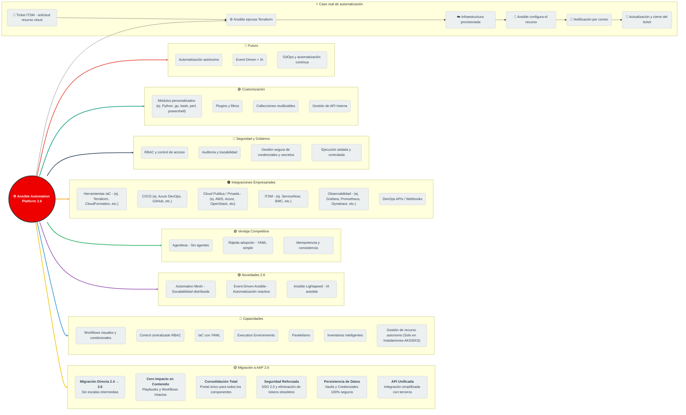

```markdown
# 🚀 Ansible Automation Platform 2.6

Diagrama de capacidades y arquitectura:
```

```mermaid
graph LR
    classDef core fill:#EE0000,stroke:#333,stroke-width:3px,color:#fff,font-weight:bold;
    classDef cap fill:#3498DB,stroke:#1F618D,color:#fff;
    classDef nov fill:#9B59B6,stroke:#6C3483,color:#fff;
    classDef ven fill:#27AE60,stroke:#1E8449,color:#fff;
    classDef int fill:#F39C12,stroke:#B9770E,color:#fff;
    classDef cus fill:#16A085,stroke:#117864,color:#fff;
    classDef fut fill:#E74C3C,stroke:#922B21,color:#fff;
    classDef sec fill:#34495E,stroke:#1C2833,color:#fff;
    classDef detail fill:#ECF0F1,stroke:#BDC3C7,color:#2C3E50;

    AAP(("⚙️ Ansible Automation Platform 2.6")):::core

    subgraph MIG["🟡 Migración a AAP 2.6"]
        M1(<b>Migración Directa 2.4 → 2.6</b><br/>Sin escalas intermedias):::detail
        M2(<b>Cero Impacto en Contenido</b><br/>Playbooks y Workflows Intactos):::detail
        M3(<b>Consolidación Total</b><br/>Portal único para todos los componentes):::detail
        M4(<b>Seguridad Reforzada</b><br/>SSO 2.0 y eliminación de tokens obsoletos):::detail
        M5(<b>Persistencia de Datos</b><br/>Vaults y Credenciales 100% seguros):::detail
        M6(<b>API Unificada</b><br/>Integración simplificada con terceros):::detail
    end
    subgraph CAP["🔵 Capacidades"]
        C1(Workflows visuales y condicionales):::detail
        C2(Control centralizado RBAC):::detail
        C3(IaC con YAML):::detail
        C4(Execution Environments):::detail
        C5(Paralelismo):::detail
        C6(Inventarios Inteligentes):::detail
        C7("Gestión de recurso autonomo (Solo en Instalaciones AKS/EKS)"):::detail
    end
    subgraph NOV["🟣 Novedades 2.6"]
        N1(Automation Mesh - Escalabilidad distribuida):::detail
        N2(Event-Driven Ansible - Automatización reactiva):::detail
        N3(Ansible Lightspeed - IA asistida):::detail
    end
    subgraph VEN["🟢 Ventaja Competitiva"]
        V1(Agentless - Sin agentes):::detail
        V2(Rápida adopción - YAML simple):::detail
        V3(Idempotencia y consistencia):::detail
    end
    subgraph INT["🟠 Integraciones Empresariales"]
        I1("Herramientas IaC - (ej. Terraform, CloudFormation, etc.)"):::detail
        I2("CI/CD (ej. Azure DevOps, GitHub, etc.)"):::detail
        I3("Cloud Publica / Privada - (ej. AWS, Azure, OpenStack, etc)"):::detail
        I4("ITSM - (ej. ServiceNow, BMC, etc.)"):::detail
        I5("Observabilidad - (ej. Grafana, Prometheus, Dynatrace, etc.)"):::detail
        I6(DevOps APIs / Webhooks):::detail
    end
    subgraph SEC["🔐 Seguridad y Gobierno"]
        S1(RBAC y control de acceso):::detail
        S2(Auditoría y trazabilidad):::detail
        S3(Gestión segura de credenciales y secretos):::detail
        S4(Ejecución aislada y controlada):::detail
    end
    subgraph CUS["🟢 Customización"]
        P1("Módulos personalizados (ej. Python, go, bash, perl, powershell)"):::detail
        P2(Plugins y filtros):::detail
        P3(Collecciones reutilizables):::detail
        P4(Gestión de API Interna):::detail
    end
    subgraph FUT["🔴 Futuro"]
        F1(Automatización autónoma):::detail
        F2(Event-Driven + IA):::detail
        F3(GitOps y automatización continua):::detail
    end
    AAP --> MIG
    AAP --> CAP
    AAP --> NOV
    AAP --> VEN
    AAP --> INT
    AAP --> SEC
    AAP --> CUS
    AAP --> FUT
    subgraph FLOW["⚡ Caso real de automatización"]
        T1(📩 Ticket ITSM - solicitud recurso cloud):::detail
        T2(⚙️ Ansible ejecuta Terraform):::detail
        T3(☁️ Infraestructura provisionada):::detail
        T4(🔧 Ansible configura el recurso):::detail
        T5(📧 Notificación por correo):::detail
        T6(📝 Actualización y cierre del ticket):::detail

        T1 --> T2 --> T3 --> T4 --> T5 --> T6
    end

    AAP --> T2
    linkStyle 0 stroke:#F1C40F,stroke-width:3px;
    linkStyle 1 stroke:#3498DB,stroke-width:3px;
    linkStyle 2 stroke:#9B59B6,stroke-width:3px;
    linkStyle 3 stroke:#27AE60,stroke-width:3px;
    linkStyle 4 stroke:#F39C12,stroke-width:3px;
    linkStyle 5 stroke:#34495E,stroke-width:3px;
    linkStyle 6 stroke:#16A085,stroke-width:3px;
    linkStyle 7 stroke:#E74C3C,stroke-width:3px;
```
